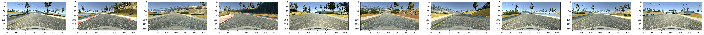
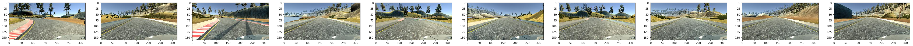
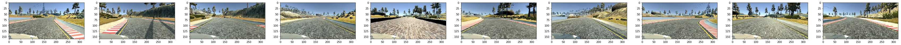
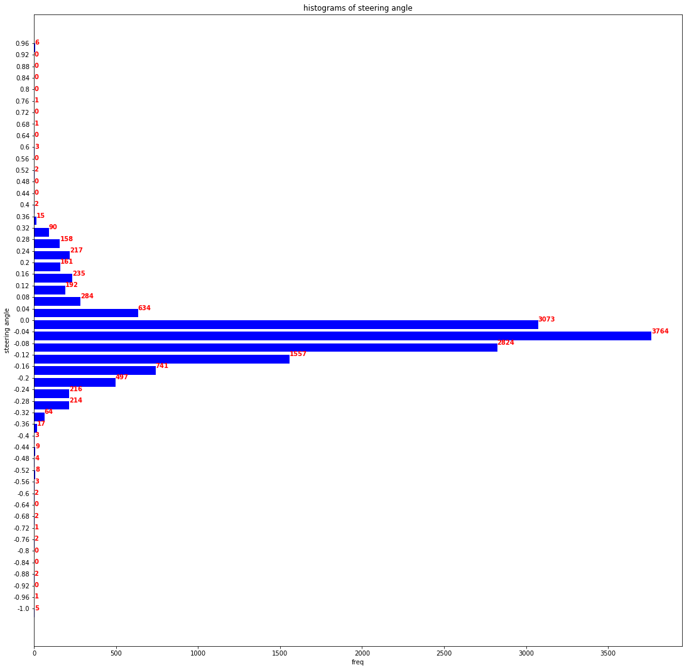
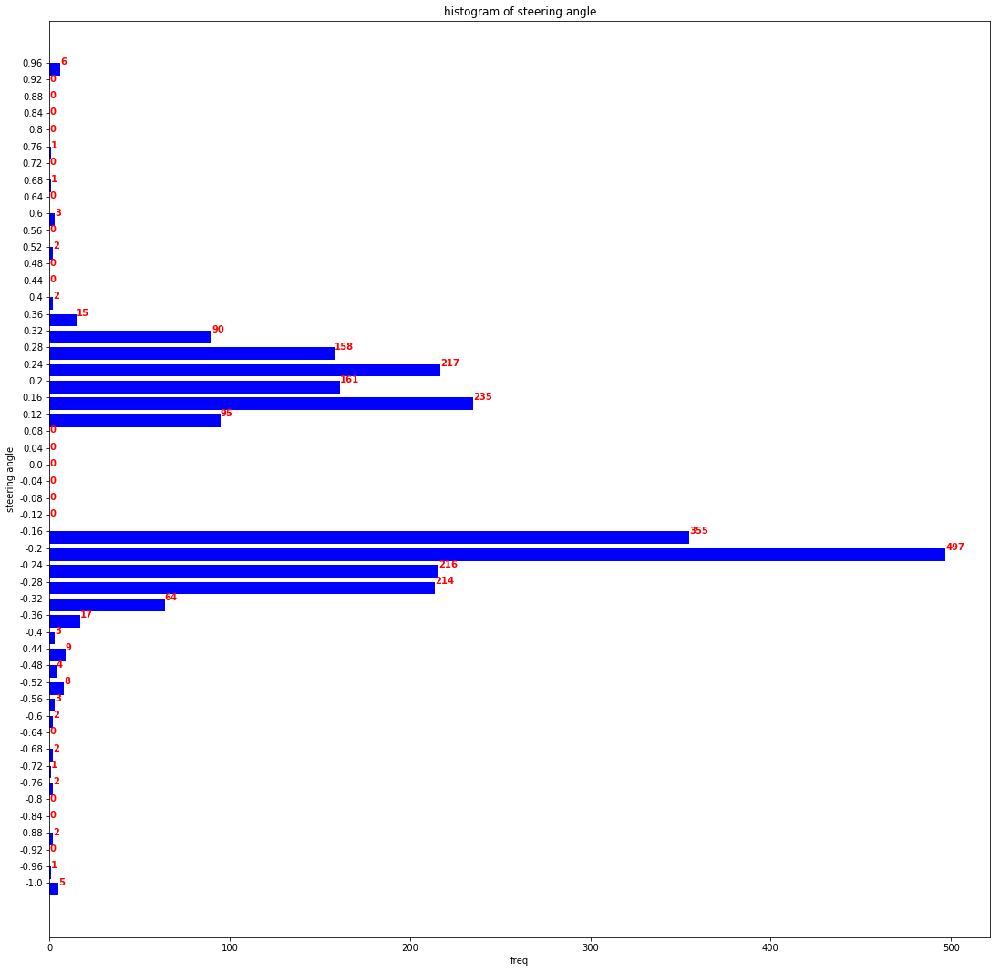
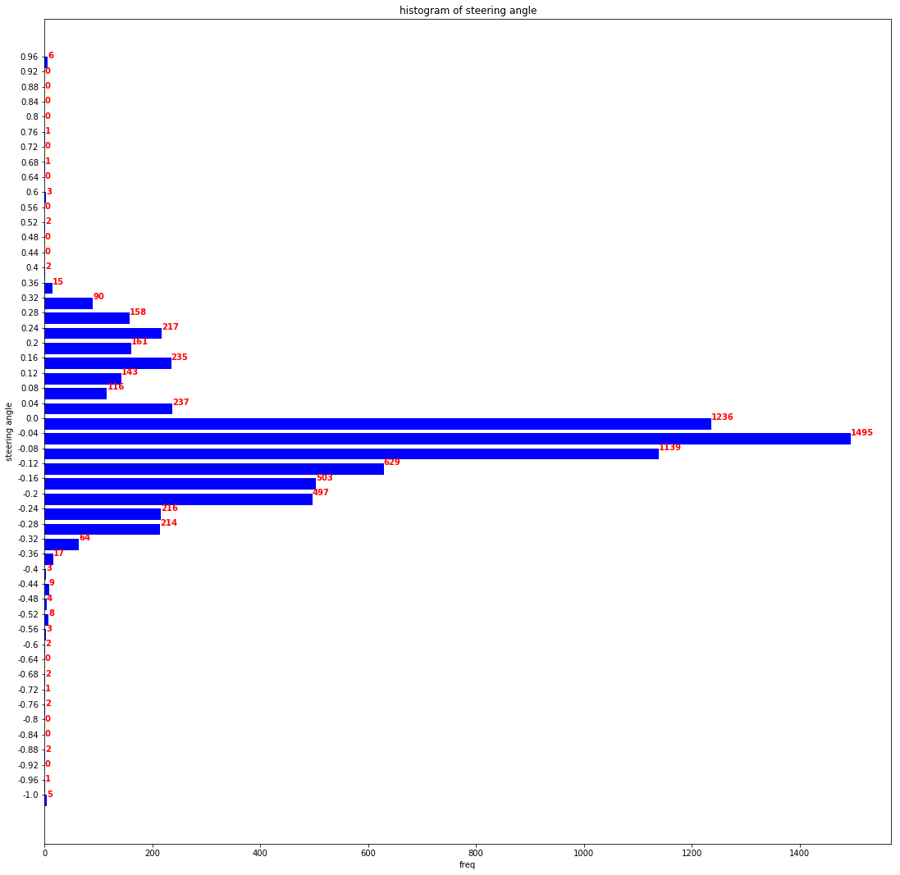
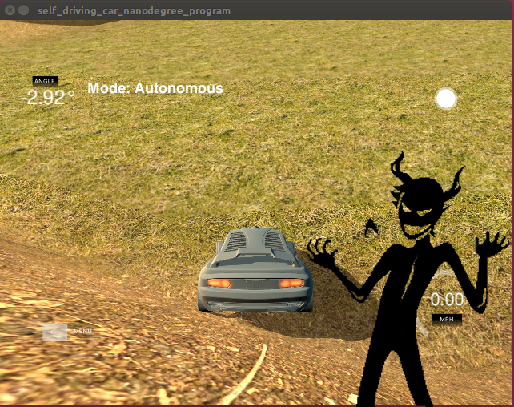
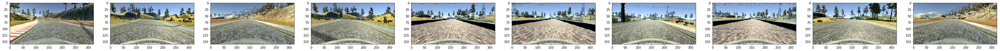
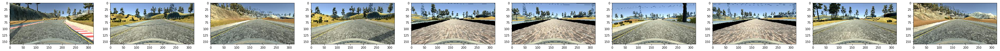
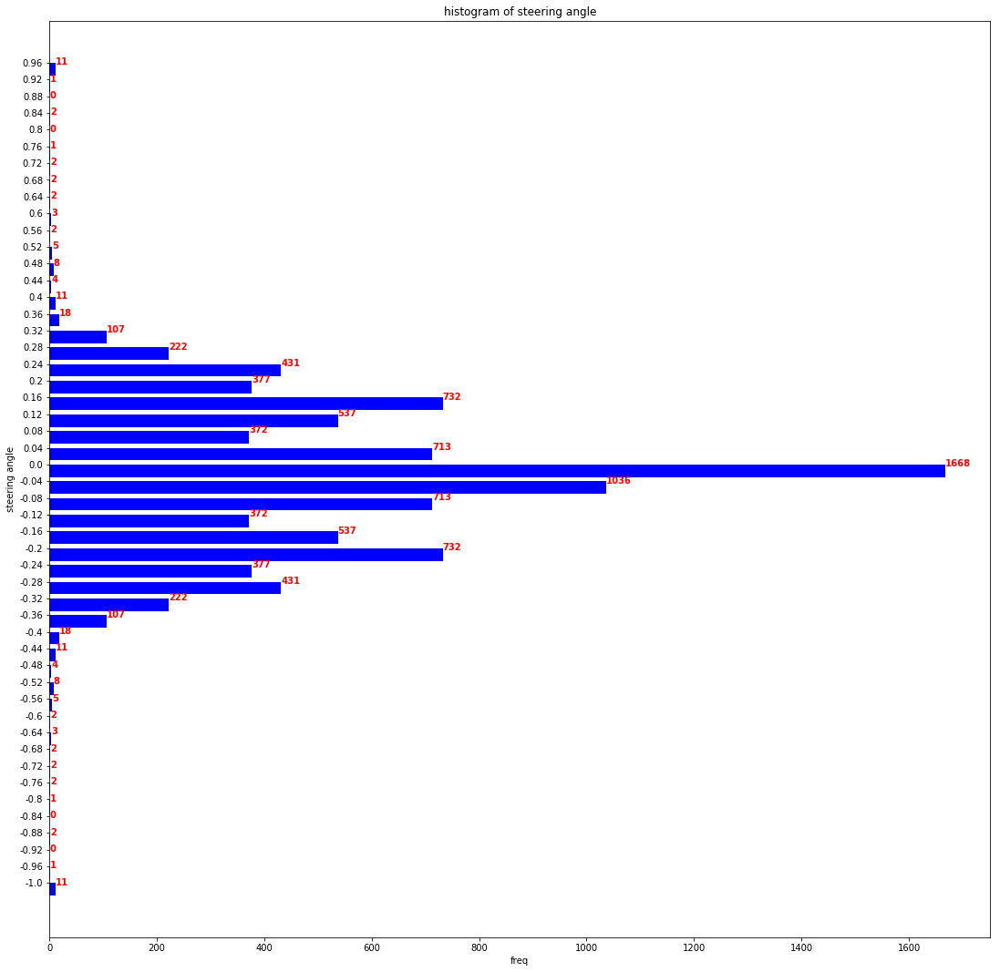

# Behavioral Cloning Project


###  Introduction 

The objective of this behavioral cloning project is to be able to drive an simulation using training data. This is achieved by training a model to drive around a track by learning from a human driver. In the training mode the snapshots of the driver's view and the corresponding steering angle are captured. In the autonomous mode the view from the driver's side is used to predict the steering angle applied to drive the vehicles 


#### Steps
1. Data Collection
2. Data Processing 
3. Modelling 


## Step1 Data Collection 
1. Center line driving: The first round of data collection just involved driving around the circuit multiple times to get enough data. Followed by training and more data collections. Its easy to realize that this is not enough. The first time the car barely drove on a straight path. 

2. Collection at failure points: One trick  that worked for me was to drive and collect more data at a failure point. This was especially true when the car drives over a curvy path.

3. Training for recovery: After noticing the car struggle to come back on to the center of the road after running on the side, I tried training that car for recovery. It is essential to skip the "bad part" when the car is swerving to the sides and train on the recovery part. 

4. Using Left and Right turn images with correction. The left and right turn images can be imagined to situations when the car has swerved to the side and is in recovery to the center. I added correction 0.1 and then increased it to 0.2 with good result,

Sample of images from the center camera.


Sample of images from the left camera.

Sample of images from the right camera/


## Step 2: Data Processing: 
Following strategies were used to processed the data
1. Normalization: The images were normalized using a keras Lambda Layer
```python
model.add(Lambda(lambda x: (x / 255.0) - 0.5, input_shape=(160,320,3)))
```
2. Cropping: The features about the road are not relevant to the turning. Cropping the top and the part of the hood of the car visible in the view helps to generalize the model. 
```python
model.add(Cropping2D(cropping=((70,25),(0,0))))
```



3. Filtering the high frequency steering angles. I discarded 60 percent of the data between -0.14 and 0.14. This also reduces the training time as there is less data to train on.


```python
df_filtered_small_str = df[ abs(df.steering_angle) > 0.14]
hist, bin_edges = np.histogram(df_filtered_small_str['steering_angle'],bins = 50)
hbarplot(bin_edges,hist, title = 'histogram of steering angle',xlabel = 'freq',ylabel='steering angle',xsize = 5,ysize =20)

```
This is what the histogram looks like without the smaller steering angles/




```python

fraction_to_cull = 0.4
df_small_str = df[ abs(df.steering_angle) < 0.14]
df_frac_small = df_small_str.sample(frac=fraction_to_cull)
df_filtered = df_filtered_small_str.append(df_frac_small)
hist, bin_edges = np.histogram(df_filtered['steering_angle'],bins = 50)
hbarplot(bin_edges,hist, title = 'histogram of steering angle',xlabel = 'freq',ylabel='steering angle',xsize = 5,ysize =20)

```
Adding the 20 percent of the small steering angles data looks like this. 



4. Flipping: Flipping the images with a corresponding flipping the sign of the steering angle generalizes the model. As seen in the histogram of the steering angles below, the data set is biased towards a left turn. This causes interesting "fails" when the car tries to turn right. It is not fun watching the car drop down into the lake!



 Before  flipping 



After flipping 

 
Flip images . The top row shows original images, while the bottom row shows flipped images 


Images were flipped using   [cv2.flip()](https://docs.opencv.org/2.4/modules/core/doc/operations_on_arrays.html#void flip(InputArray src, OutputArray dst, int flipCode) function.

Post flipping and filtering the data set looks more balanced. 



## Step 3 Modelling
The first neural network I tried was a basic convolutional network with one dense layer to get the pipeline running.

* Convolution2D(16) 5X5 filter
* Dense(10)

The resulting model failed on the curves. 
Next I used a more complex model smiliar to the [NVIDIA](https://images.nvidia.com/content/tegra/automotive/images/2016/solutions/pdf/end-to-end-dl-using-px.pdf) network which worked very well. I used an 80/20 split for the training data and used an adam optimizer. 

* Convolution2D(16) 5x5 filter 
* Convolution2D(32) 5x5 filter 
* Convolution2D(48) 5x5 filter
* Convolution2D(64) 3x3 filter 
* Convolution2D(128) 3x3 filter 
* Dense(100)
* Dense(50)
* Dense(10)

Training on a larger network meant the I had to use a generator to avoid the "Out of memory" error. 


```python

def generator(X_paths,y,batch_size = 32):
    num_samples = len(X_paths)
    batch_offset = int(batch_size/2)
    while 1:
        for offset in range(0, num_samples, batch_offset):
            X_paths_sample = X_paths[offset:offset + batch_offset]
            y_sample = y[offset:offset + batch_offset]
            X_sample = [read_image(file,"/home/william/Desktop/IMG") for file in X_paths_sample]
            # add image flips
            X_sample_flipped = [flip_image(file, "/home/william/Desktop/IMG") for file in X_paths_sample]
            y_sample_flipped = y_sample*(-1)
            # concatenate
            X_concat = X_sample+X_sample_flipped
            y_concat = np.concatenate((y_sample,y_sample_flipped))
            X_train = np.array(X_concat)
            y_train = np.array(y_concat)
            yield shuffle(X_train, y_train)

train_generator = generator(X_train,y_train, batch_size=64)
validation_generator = generator(X_test,y_test, batch_size=32)

```
The generator runs continously returning batches of data for training. This also required changes to the how I was loading the data. Instead of reading the data and passing the entire array of images, I could read images in batches. 


## Discussion:
This was the most nerve wracking as well as fulfilling exercise of all. It almost seemed impossible to training the car to follow the centerline. Its hard to see what changes to make and training time is very large to see get feedback on your changes. The final result is 
a feeling a great accomplishment.

I tried running the model on track 2, but it failed. The next step will be to augment dataset with "Shadow augmentation" and  "Brightness augmentation" presented in this [blog](https://chatbotslife.com/using-augmentation-to-mimic-human-driving-496b569760a9)

Although the accuracy of  the model in traning and validation can be measured, it is hard to tell if the model will fail on the real track. This is an interesting characteristic of this problem. Minimization of validation and training loss although good, is not a sign of success. 

[](https://www.youtube.com/watch?v=qkYZLsq2QAc "Result")

